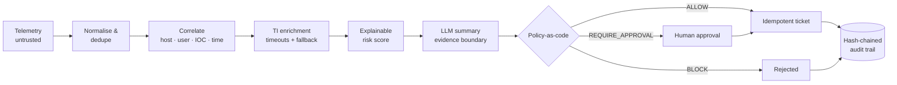
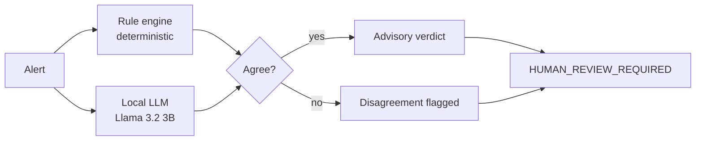

<p align="center">
  <picture>
    <source media="(prefers-color-scheme: dark)" srcset="assets/banner-dark.png" />
    
  </picture>
</p>

<p align="center">
  🛡️ <b>SOC (L2)</b> · 🚨 <b>Incident Response</b> · ⚙️ <b>Security Automation</b> · 🤖 <b>AI-assisted triage with guardrails</b>
</p>

<p align="center"><i>🤖 AI assists. 🧠 Humans decide. 🔗 Everything is logged.</i></p>

<p align="center">
  <a href="https://www.rahulshrivastava.co.in"></a>
  <a href="https://www.linkedin.com/in/shriv-rahul/"></a>
  <a href="mailto:shrivastava.rahul97@gmail.com"></a>
  
</p>

---

### 👨‍💻 `$ whoami`

```yaml
# rahul.yaml — policy-as-code, applied to a career
name:        Rahul Shrivastava
role:        Security Operations Engineer
experience:  "3+ years — SOC L2 @ WellMark Technology · freelance IR, SOC monitoring & VAPT"
operates:    [Splunk, Microsoft Sentinel, Google Chronicle, Defender XDR, Splunk SOAR, Palo Alto XSOAR]
builds:      "Python automation that makes SOCs faster — and auditable"
principles:
  - signal_over_noise        # tune with context, never by muting coverage
  - recommend_before_act     # automation proposes; policy gates what executes
  - evidence_or_it_didnt_happen
frameworks:  [MITRE ATT&CK, NIST CSF 2.0, NIST SP 800-61, ISO 27001, SOC 2, CIS Controls]
open_to:     [Security Operations Engineer, SOC Analyst, Information Security Engineer]
```

---

### 📈 Impact in production — numbers, not adjectives

| | Outcome | How |
|---|---|---|
| 🔇 | **False-positive rate ↓ 20–40%** | Correlation + refined triage criteria across three SIEMs |
| ⏱️ | **MTTR improved up to 25%** | Streamlined escalation workflows, firewall/VPN fixes |
| 🚨 | **50–100 alerts/day** triaged | Splunk · Google Chronicle · Microsoft Sentinel |
| 🖥️ | **200+ endpoints** hardened & monitored | Microsoft Defender · Fortinet · Sophos |
| 🔎 | **4–10 incident reports & RCAs / month** | Root cause, not just closure |
| 🧪 | **16–30 freelance engagements** | Pentests, SOC monitoring, IR — FMCG, e-commerce, Web3 |
| 📊 | **500+ weekly alerts analysed → ~60% FPs** | Turned into alert-handling playbooks |

---

### 🕹️ Live &amp; interactive — click and try

| | Project | |
|---|---|---|
| 🎯 | **[AI Red-Team Playground](https://github.com/CdxDebian/AI-Redteam-Playground)** — break an AI agent in your browser; a provenance-aware gate decides every tool call live, mapped to MITRE ATLAS &amp; OWASP LLM. | [**▶ Live demo**](https://cdxdebian.github.io/AI-Redteam-Playground/) |
| 🧭 | **[SOC Field Manual](https://github.com/CdxDebian/SOC-Field-Manual)** — a searchable analyst reference: event IDs, KQL/SPL, ATT&CK, IR steps, India cyber clocks. | [**▶ Live demo**](https://cdxdebian.github.io/SOC-Field-Manual/) |
| 🛡️ | **[AgentGate](https://github.com/CdxDebian/AgentGate)** — the tested Python guardrail behind the playground; CI red-team gate drives attack success **54% → 0%**. | `code` |
| 📓 | **[IR-Playbooks](https://github.com/CdxDebian/IR-Playbooks)** — 10 scenario playbooks mapped to MITRE ATT&CK, ATLAS &amp; OWASP LLM. | `code` |

---

### 🚀 Featured builds

#### 🛡️ [SOC Incident Orchestrator](https://github.com/CdxDebian/SOC-Incident-Orchestrator) — AI-assisted incident response pipeline
Ingests security telemetry, correlates it into incidents, scores risk *with its reasons*, and lets an LLM summarise — while a policy layer decides what may actually happen.



- 💉 **Prompt-injection defence:** telemetry is treated as data, never instructions; schema validation, confidence thresholds, retry/fallback
- 🧩 **Explainability:** every score persists its contributing factors; behaviour mapped to MITRE ATT&CK with evidence
- 🔗 **Audit-ready:** tamper-evident hash chain with secret redaction; compliance-evidence mapping to SOC 2, ISO 27001, NIST CSF
- 🐳 **Shipped like software:** Docker / docker-compose, pytest adversarial suite (injection, malformed input, policy correctness, idempotency), threat model

`Python` `FastAPI` `Pydantic` `SQLite` `Ollama` `Docker` `pytest` `MITRE ATT&CK`

#### 🤖 [AI-SOC Alert Triage](https://github.com/CdxDebian/AI-SOC-Alert-Triage) — dual-signal, advisory-only triage
A local LLM and a deterministic rule engine score every alert independently. **Disagreement is surfaced, not averaged away.**



- 📦 Structured JSON: severity, ATT&CK mapping, plain-English summary, next action, confidence
- 🚫 **Never auto-blocks or remediates** · all inference local — no alert data leaves the host
- 📊 Streamlit review dashboard + CLI

`Python` `Ollama` `Streamlit` `MITRE ATT&CK`

---

### 🧭 How I build security tooling — my engineering creed

| Principle | In practice |
|---|---|
| 🕵️ **Telemetry is untrusted input** | Attackers write the logs you parse — delimit, validate, never execute |
| 🧾 **Explain every score** | A verdict without reasons can't be audited or tuned |
| 🔁 **Idempotent by default** | Retries must never double-ticket or double-act |
| ✋ **Humans own irreversible actions** | Isolation, blocks and disables pass an approval gate |
| 🪂 **Degrade gracefully** | A dead TI feed should slow enrichment, not stop response |
| 🔒 **Tamper-evident by design** | If a regulator asks "who decided?", the log answers |

---

### 🧰 Arsenal

🔭 **SIEM & Detection**


🖥️ **Endpoint & Network**


⚙️ **SOAR & Threat Intel**


🗡️ **Offensive & Vulnerability**


🧑‍💻 **Engineering**


---

### 🎓 Certifications

✅ **Completed** — Google Cybersecurity Professional Certificate (v2) · Google AI Professional Certificate · Google Generative AI Leader · Google IT Support Professional Certificate · EC-Council Information Security Fundamentals · IBM Cybersecurity Roles, Processes & OS Security

⏳ **In progress** —  

### 🏆 Hackathons
🥇 Winner — All India Hackathon 2022 (RPA) · 🥈 Runner-up — Vadodara Smart Hackathon 2020 (IoT) · Semi-finalist — All India Hackathon 2021 (DDoS protection)

---

### 🔭 On the roadmap
- 🧪 **Detection-as-code** — KQL/SPL detections mapped to ATT&CK, each with test data and a documented false-positive profile
- 📁 **Control-evidence automation** — scheduled control checks mapped to ISO 27001 / NIST CSF, packaged as hash-verified audit evidence

---

### 🎯 Currently
- 📚 Studying for **Microsoft SC-200** and **CompTIA Security+**
- 🔬 Hardening my builds with adversarial tests and evaluation data
- 💼 Open to **Security Operations / SOC / Information Security Engineer** roles — ⚡ immediate joiner

---

<p align="center">
  <sub>🧾 Every alert closed with a reason. 🔎 Every incident ends with a root cause.</sub><br/>
  <a href="https://www.rahulshrivastava.co.in">rahulshrivastava.co.in</a> ·
  <a href="https://www.linkedin.com/in/shriv-rahul/">LinkedIn</a> ·
  <a href="https://github.com/CdxDebian">GitHub</a>
</p>

